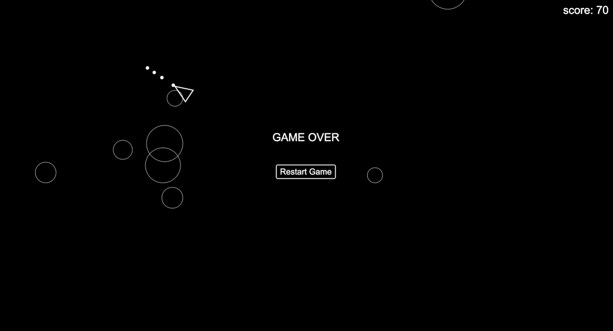

# Asteroid Game with Honeycomb Telemetry

## Project Overview

The asteroid game is based on a tutorial by Net Ninja and refactored with added functionality. I started this project to gain a deeper understanding of Honeycomb from a user perspective. It utilizes Node.js and Express for the backend and includes Honeycomb integration for monitoring gameplay. It is a space shooter game in which you navigate a spaceship, shoot asteroids, and achieve high scores.

### Key Features

- **Gameplay**: Navigate and shoot asteroids to achieve high scores.
  Use UP ARROW to excelerate
  LEFT ARROW to rotate left
  RIGHT ARROW to rotate right
  SPACEBAR to shoot

- **Telemetry**: Honeycomb integration for observing game performance, errors, and user engagement.



## Project Structure

```plaintext
.
├── public
│   ├── index.html     # Main game HTML file
│   ├── styles.css     # Game styles
│   └── index.js       # Game logic
│   └── images         # Screenshot
│   └── scripts        # Game logic
        └── Asteroids.js     # Asteroid logic
        └── Player.js        # Player logic
        └── Shooter.js       # Shooter logic
        └── CanvasUtil.js    # Canvas logic
        └── index.js         # Game logic
├── server.js          # Express server
├── tracing.js         # Honeycomb OpenTelemetry configuration
└── README.md          # This file
```

### Prerequisites

- Node.js (version 14+ recommended)
- Honeycomb API Key: Obtain an API key from Honeycomb.io.
